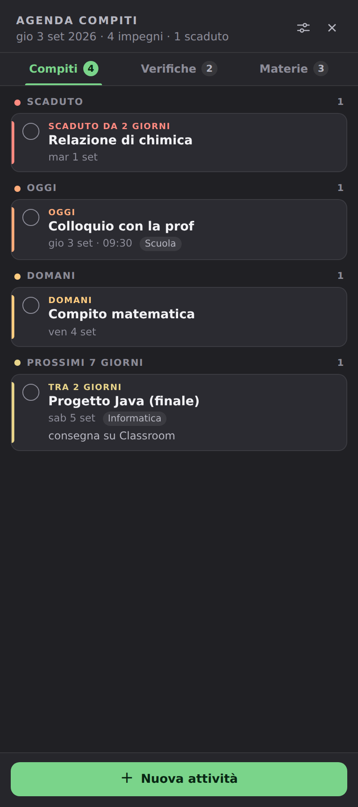
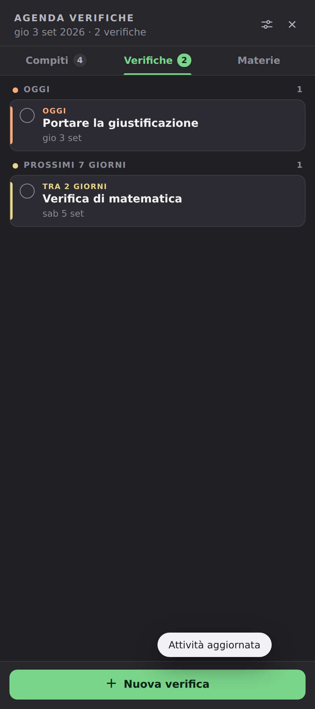
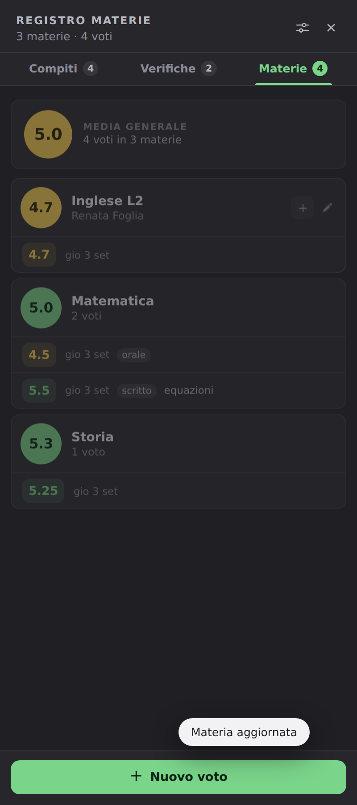

# UdiAgenda

Pannello laterale a scomparsa per Windows 11 per gestire **compiti**, **verifiche** e **voti**.
Un solo file `.exe`, nessuna installazione, nessun account, nessun server: i dati restano sul computer.

---

## Perché l'ho creato

Era da parecchio tempo che cercavo un software per l'organizzazione scolastica, ma non ne ho mai
trovato uno che mi andasse bene: o mi trovavo male a usarlo, o le funzioni che mi servivano davvero
erano a pagamento, o erano applicazioni enormi pensate per tutt'altro.

Così ho deciso di scrivermela da solo, fatta **come sono fatto io**: con quello di cui ho bisogno,
niente di più, e con il comportamento che trovo comodo mentre lavoro al computer.

L'idea di partenza è una sola: un'agenda scolastica **non deve disturbare**. Non serve un programma
che occupa mezzo schermo o che manda notifiche mentre studio o faccio altro. Serve qualcosa che stia
lì, zitto, e che sia raggiungibile in un secondo quando mi viene in mente un compito o prendo un voto.
Da qui la scelta del pannello laterale: sempre disponibile, mai invadente.

---

## Com'è fatta (e perché così)

<p>
  
  
  
</p>

**Una linguetta sul bordo dello schermo, non una finestra.**
All'avvio non si apre nessuna finestra: sul bordo destro compare solo una piccola linguetta. Un clic
e il pannello (circa 400 px) scorre da destra con un'animazione breve; un altro clic, un clic fuori
o il tasto `Esc` e si richiude. Lo spazio di lavoro resta libero.

**La linguetta si nasconde da sola.**
Quando il mouse è lontano dal bordo, o quando sta fermo da qualche secondo, la linguetta rientra e
sparisce. Riappare avvicinando il puntatore al bordo, all'altezza giusta. È la scelta che mi ha
richiesto più prove: una linguetta sempre visibile dava fastidio, una linguetta che apriva il
pannello da sola lo faceva ancora di più. Così l'avvicinamento mostra soltanto la linguetta, mentre
ad aprire il pannello è solo il clic.

**Tre sezioni, non tre programmi.**
Compiti, Verifiche e Materie sono tre schede dello stesso pannello, con il numero di elementi
accanto al nome. Compiti e verifiche funzionano allo stesso modo (stessa priorità, stesso
ordinamento), perché nella pratica sono la stessa cosa con due agende diverse.

**La priorità la calcola il programma.**
Non c'è nessun campo "importanza" da compilare: l'urgenza si ricava dalla data
(`SCADUTO · OGGI · DOMANI · PROSSIMI 7 GIORNI · PIÙ AVANTI`) e l'ordinamento è sempre dalla scadenza
più vicina alla più lontana. Per inserire qualcosa bastano **nome e data**; ora, categoria e nota
sono facoltative. Meno campi obbligatori = più probabilità che l'attività venga davvero inserita.

**Voti sulla scala svizzera 1–6.**
I voti si scrivono come si dicono (`4.7`, `5.25`). Ogni materia mostra la propria media in un
cerchio colorato — rosso sotto il 4, arancione sotto il 4.5, giallo sotto il 5, verde dal 5 — e in
cima c'è la media generale. Il colore dice com'è messa la materia senza bisogno di leggere i numeri.

**Nessuna notifica, nessun popup, nessun suono.**
È una scelta, non una mancanza: le notifiche sono esattamente la cosa che mi faceva disinstallare
gli altri programmi. Le informazioni si guardano quando si vuole, aprendo il pannello.

**Avvio automatico con Windows.**
Il programma si registra da solo all'avvio (una voce nel registro dell'utente) e parte in silenzio
insieme al sistema: nessuna finestra, solo la linguetta sul bordo. Si disattiva con un interruttore
nelle impostazioni. È ciò che rende il tutto utile davvero: non bisogna ricordarsi di aprire l'app,
c'è già.

**Dati locali, nient'altro.**
Tutto sta in un database SQLite dentro `%LOCALAPPDATA%\UdiAgenda\`. Nessun account da creare, nessun
server, nessuna connessione a internet: il programma funziona anche offline e i dati non escono dal
computer.

**Un solo file eseguibile.**
Niente installazione, niente .NET da scaricare, nessuna DLL a fianco: si copia `UdiAgenda.exe` dove
si vuole e si fa doppio clic. L'interfaccia è HTML/CSS/JavaScript incorporati nell'eseguibile e
mostrati dentro **WebView2**, il componente di Edge già presente in Windows 11; le finestre e la
linguetta sono Win32 puro, così il programma resta leggero e non ruba il fuoco alle altre applicazioni.

---

## Vantaggi

- **Non invasivo**: nessuna finestra fissa, nessuna notifica, nessun ingombro sullo schermo.
- **Sempre a portata**: un clic sul bordo e l'agenda è lì, in qualsiasi momento e sopra qualsiasi programma.
- **Veloce da usare**: nuova attività con due soli campi obbligatori, `Ctrl+N` per aggiungere, `Esc` per chiudere.
- **Zero configurazione**: si apre e funziona; l'avvio con Windows è già attivo.
- **Priorità automatica**: l'ordine e l'urgenza si aggiornano da soli con il passare dei giorni.
- **Privato**: dati solo sul proprio computer, nessun account, nessun cloud, funziona offline.
- **Leggero**: a pannello chiuso il programma controlla soltanto la posizione del mouse.
- **Portabile**: un unico `.exe` che si può tenere anche su una chiavetta.
- **Gratuito e aperto**: nessuna funzione a pagamento, codice sorgente incluso.

---

## Installazione

1. Scarica `UdiAgenda.exe` dalla sezione **Releases** di questa pagina.
2. Copialo dove preferisci (per esempio `C:\Users\<tuonome>\UdiAgenda\`), evitando la cartella Download.
3. Doppio clic. Al primo avvio il pannello si apre da solo per mostrarti dov'è.
4. Se Windows mostra l'avviso SmartScreen (normale per i programmi senza firma digitale a pagamento):
   *Ulteriori informazioni* → *Esegui comunque*.

Unico requisito: **Microsoft Edge WebView2 Runtime**, già presente in Windows 11 e in Windows 10 aggiornato.

## Uso rapido

| Azione | Come |
|---|---|
| Aprire il pannello | clic sulla linguetta sul bordo destro |
| Chiudere | clic fuori dal pannello, sulla ✕, o `Esc` |
| Nuova attività | pulsante in basso oppure `Ctrl+N` |
| Completare / eliminare | cerchietto a sinistra / menu della singola voce |
| Impostazioni | icona in alto a destra nel pannello |
| Uscire | tasto destro sulla linguetta → *Esci* |

Nelle impostazioni: tema chiaro/scuro/automatico, colore di evidenziazione, lato e posizione della
linguetta, larghezza del pannello, avvio automatico con Windows.

---

## Dove sono i dati

```
%LOCALAPPDATA%\UdiAgenda\
    udiagenda.db      database SQLite (compiti, verifiche, materie, voti)
    settings.json     impostazioni
```

Per un backup basta copiare questa cartella. L'avvio automatico è una sola voce nel registro
dell'utente: `HKCU\Software\Microsoft\Windows\CurrentVersion\Run\UdiAgenda`.

## Se prima usavi "Impegni"

UdiAgenda è la stessa applicazione con il nome nuovo. Al primo avvio sposta da sola i dati della
versione precedente (`%LOCALAPPDATA%\Impegni` → `%LOCALAPPDATA%\UdiAgenda`, `impegni.db` →
`udiagenda.db`): compiti, verifiche, materie, voti e impostazioni restano quelli di prima. La
vecchia voce di avvio automatico viene rimossa, così non resta un avvio che punta a un programma che
non esiste più; il vecchio `Impegni.exe` si può cancellare.

---

## Tecnologie

| Parte | Scelta | Perché |
|---|---|---|
| Linguaggio | **Go 1.24** | compila in un unico eseguibile senza runtime da installare |
| Interfaccia | HTML/CSS/JS in **WebView2** | già presente in Windows 11, interfaccia moderna senza librerie esterne |
| Finestre e linguetta | **Win32** (`CreateWindowExW`, `SetWindowPos`, `WM_TIMER`) | controllo preciso su posizione, animazione e comportamento |
| Dati | **SQLite** (`ncruces/go-sqlite3`, pura Go) | database locale in un file, senza DLL native |
| Avvio automatico | chiave `Run` del registro utente | nessun servizio, nessun task, si toglie con un clic |

## Struttura del progetto

```
cmd/udiagenda/        avvio dell'applicazione (Windows) e anteprima di sviluppo
internal/core/        modello, database, impostazioni, servizio — indipendente dal sistema
    task.go           attività, tipo (compito/verifica), livelli di urgenza
    registro.go       materie, voti, medie e fasce di colore (scala 1-6)
    store.go          SQLite: schema, migrazioni, CRUD, ordinamento
    settings.go       impostazioni su file JSON
    paths.go          cartelle dei dati e migrazione dalla versione precedente
    service.go        API unica usata dall'interfaccia
internal/ui/          interfaccia (index.html, styles.css, app.js) incorporata con go:embed
internal/winui/       livello Windows: finestre, animazione, WebView2, registro, tema
internal/devserver/   server HTTP di sviluppo per provare l'interfaccia fuori da Windows
```

Le migrazioni del database sono additive e idempotenti: un database creato con una versione
precedente viene aggiornato all'apertura senza perdere nulla.

## Compilare

Serve solo [Go](https://go.dev/dl/) 1.24 o superiore (niente Visual Studio, niente .NET).

```
BUILD.bat        scarica le dipendenze, compila -> UdiAgenda.exe
PUBLISH.bat      test + build definitiva      -> dist\UdiAgenda.exe
```

Da riga di comando, anche in cross-compilazione da Linux o macOS:

```bash
go mod tidy
CGO_ENABLED=0 GOOS=windows GOARCH=amd64 \
  go build -trimpath -ldflags="-s -w -H windowsgui" -o UdiAgenda.exe ./cmd/udiagenda
```

Test della logica (funzionano su qualsiasi sistema operativo):

```bash
go test ./internal/core/
```

Anteprima dell'interfaccia fuori da Windows:

```bash
go run ./cmd/udiagenda      # poi apri http://127.0.0.1:8765
```

---

## Stato e limiti

Versione 1.5, in uso quotidiano. Funziona su **Windows 11 x64** (e Windows 10 aggiornato).
Non è previsto il supporto a macOS e Linux: la linguetta e le finestre usano API di Windows.
Non ci sono notifiche né sincronizzazione fra dispositivi, ed è voluto.

## Licenza

MIT — vedi il file [LICENSE](LICENSE).
